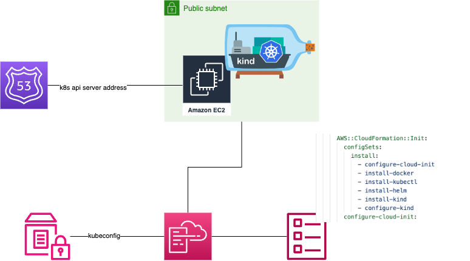

#  Kind On EC2

The Cloud Formation Stack is intended to provision a EC2 instance with a kubernetes kind 
distribution configured with nginx ingress controller and local-path-provisioner storage class.
Moreover the stack make sure that all the cluster is fully configured tanks to the CFN Init together to CFN Signal feature of Cloudformation.
All is delivered with the needed security group Route53 endpoint for the api server and a valid kubeconfig on the parameter store

## Architecture

