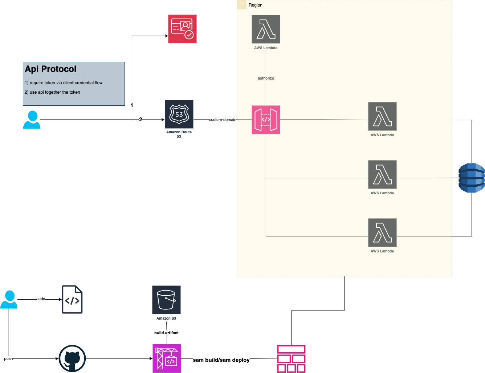

#  Todo Service With SAM

In computer science the hello world is the simplest code example, 
but in this case in order to show some more complex I decided to adopt 
another popular way simple example..... a todo api.

In this case I show how to build a simple serverless todo api implemented with Lambda 
as backend, Dynamo DB as persistence layer, Api GW as api entrypoint and AWS Cognito as IDP, 
included Lambda authorizer for api gw in order to show a complete api example. 

In order to make the sample up and running you need to have a DNS domain registered in Route53 
and a https certificate in AWS ACM

The showcase add cloud formations for create the CD/CI pipeline needed to provision all the resources. 
Notable is how tanks to AWS SAM (Serverless Application Model), the official serverless framework provided 
by AWS in order to develop serverless applications, it is very easy achieve incremental deployments as below:

```yaml
...
ReadTodo:
  Type: AWS::Serverless::Function 
  ...
  Properties:
    AutoPublishAlias: "live"
    DeploymentPreference:
      Type: Linear10PercentEvery1Minute
   ...
```

## Api

 
- GET /todo 
  - get all todos
- PUT /todo
  - create a new todo
  - body request: ```{"message":"something to do ...."}```
- DELETE /todo/{id}
  - delete one todo by id

## Architecture

