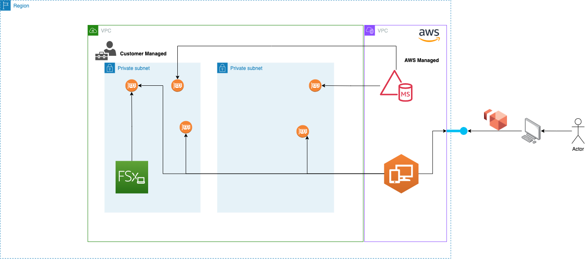

#  WorkSpace with MS AD and FSx for Windows

The Cloud Formation Stack is intended to provision a Windows based (Windows Server 2019) AWS WorkSpace 
instance federated with the full managed AWS MS AD and FSx for Windows as shared filesystem  

The Stack requires a VPC, it is composed by two stacks, the first is intended to provision the basic infrastructure: 
AWS full managed MS AD, FSx for Windows together with the security group. The Second stack is responsible to provision the actual 
AWS WorkSpace instance.   

Unfortunately due to a CloudFormation limitation after that the first stack run it is required to manually register into the 
WorkSpace ui the MS AD how discussed in this [link](https://docs.aws.amazon.com/workspaces/latest/adminguide/register-deregister-directory.html).

After that the second stack run, in order to use the FSx file system, it is required to allow traffic in the inbound 
FSx security group rule for the port 445 and 5985 for the security group of the AWS WorkSpace. Unfortunately 
even in this case via cloud formation is not possible to access to the underline autogenerated workspace security group 
and therefore some manual steps are required. If you are interested more on the network requirements that FSx requires 
you can have a look to this [link](https://docs.aws.amazon.com/fsx/latest/WindowsGuide/limit-access-security-groups.html)

Of course if you are interested to mount the file system in the WorkSpace instance you can have a look to the FSx 
admin console to consult the mounting command provide in the console.

For powershell it should look like below:

> net use Z: \\<your-fsx>\share

## Architecture

